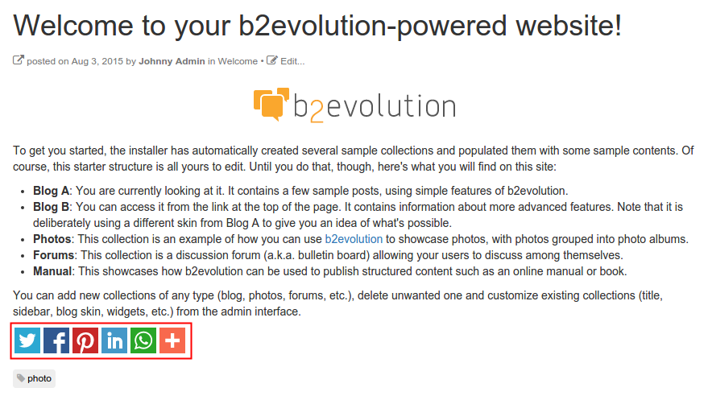
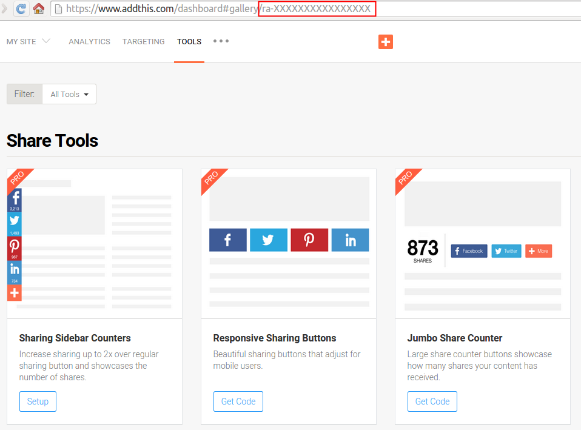
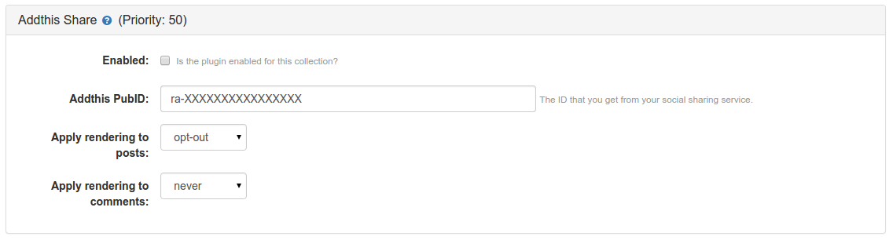
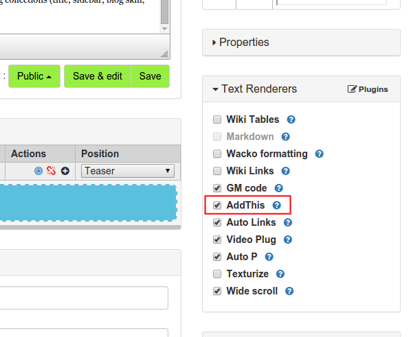

## AddThis plugin for b2evolution

Using this plugin you can add the AddThis sharing bar to the contents of your site and let your visitors share them to their preferred social networks and websites.

### Installation

You can use this plugin in your site by following the regular plugins installation process detailed in this manual page: [Plugins available for installation](http://b2evolution.net/man/plugins-available-for-installation).

After having successfully installed the plugin in your site, you need to configure the **AddThis** account in order to get a PubID, which is a code with the following format: ra-XXXXXXXXXXXXXXXX.

1. Go to the [AddThis website](http://www.addthis.com/) and register a new user account (if you have not done it yet).
2. Click on the **Tools** options of the main menu and copy the PubID from the URL .
3. Go back to your b2evolution site and open the plugins settings page of your desired collection: [Plugin Settings](http://b2evolution.net/man/blog-plugin-settings)
4. Enable the plugin for that collection and paste the PubID code ().

**Note:** as this is a Text Renderer plugin, you may control when to enable / disable it for individual posts by checking the **AddThis** option in the **Text Renderers** panel of the posts' edition form. ().

